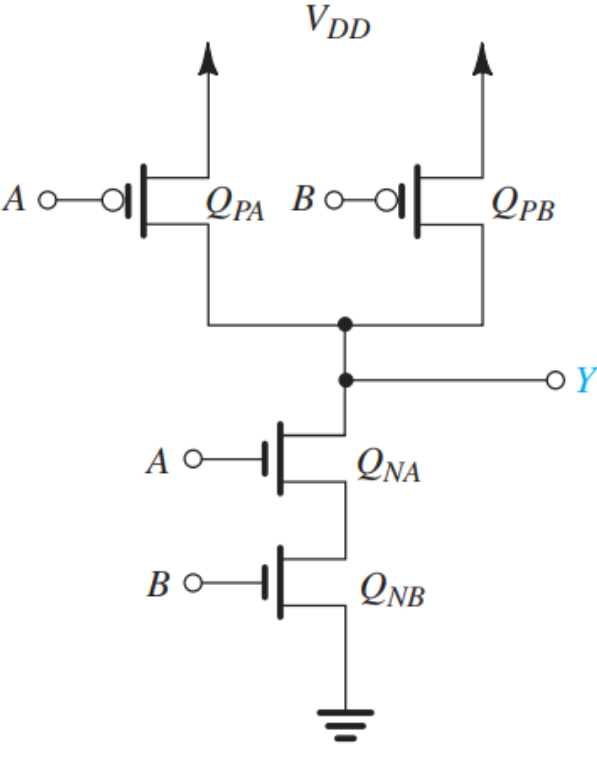
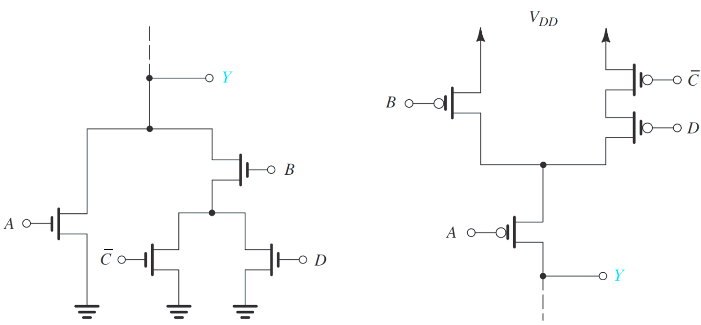
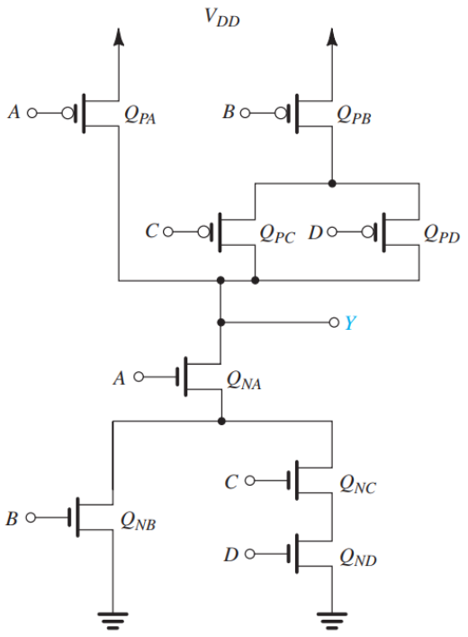

# CMOS-Circuit-SPICE-Generator
The goal of this project is to implement a program that generates the part of a SPICE netlist (also known as a SPICE deck) that describes a CMOS circuit realizing an arbitrary Boolean function provided by the user.

The goal of this project is to implement a program that generates the part of a SPICE netlist (also known as a SPICE deck) that describes a CMOS circuit realizing an arbitrary Boolean function provided by the user. The project is implemented in C++. This solution supports parentheses to appear in input expressions to override original operator precedence. Implementing this feature would make the following input valid: y=((a|b)&(c|d)’)’ Furthermore, it supports multiple semicolon-separated output symbols in the input expressions. Implementing this feature would make the following input valid: y=a&b|c’; x=y’|a|c

## Implementation Details:
### Algorithms:
The project is divided into three main steps: First, the Boolean expression input is first converted into postfix order. For example, if the expression is Y = A | B & (C' | D), then its corresponding postfix is CD&B|A&. The resulted expression of this state is then sent to a function to obtain the PDN and PUN of that expression. It produces the PUN by simplifying the expression and applying an imitating behavior of DeMorgan’s law when needed. The PDN is then obtained by negating the expression. The output of the function is another postfix expression corresponding to PDN or PUN. Those expressions are finally sent to a recursive function that generates the SPICE list, once for the PUN, and another for the PDN. It starts from the end of the expression, then recursively constructs new Mosfets with the right connections.


### Data Structure:
CMOS transistors are represented using a struct that contains all their data:
```
struct CMOS {
string m_name;
string drain;
string gate;
string source;
string body;
m_type type;
};

```
A vector of this struct is created to store all the created CMOS transistors to be printed later. Expressions are stored in vectors of characters and are referenced to functions to be operated on.

## User Guide:
To compile and execute the program with GCC compiler on Linux, open the terminal and change the directory to the location of the code files, then write the following:
```
$ make
$./run EXPRESSION
```
For executing in windows, open the CMD shell in the containing folder, then write the
following:
```
> make
> ./run
```

Then, enter the Boolean expression when prompted by the program. You can input any Boolean expression using any symbols; however, the output symbol cannot be used as an input symbol. The &, |, and ' operators are used for AND, OR, and NOT respectively. NOT has the highest precedence while OR has the least precedence. For example: y=a&b|c’ is a valid input, while y = y|a is not.

The output is of the form:
Mname drain gate source body type


## Assumptions:
1. Spaces and numbers are not allowed in the input expressions
2. Symbols in the input expression are case-sensitive. X is a different symbol from x.
3. There is always a net called VDD which represents the positive terminal of an independent DC voltage source.

## Test Cases:

### Test case 1
Expression: (A & B) '
PUN: A' & B'
PDN: A & B

SPICE Statement:
M1 Y B VDD VDD PMOS
M2 Y A VDD VDD PMOS
M3 Y A 1 1 NMOS
M4 1 B 0 0 NMOS

Circuit:
<p align="center">

</p>

### Test case 2
Expression: (A | B & (C' | D)) '
PUN: Y = A' & (B' + C & D')
PDN: Y' = A | B & (C' | D)

SPICE Statements:
M1 Y A 1 1 PMOS
M2 1 B VDD VDD PMOS
M3 1 D 2 2 PMOS
M4 3 C VDD VDD PMOS
M5 3 C 0 0 NMOS
M6 2 3 VDD VDD PMOS
M7 Y A 0 0 NMOS
M8 Y B 4 4 NMOS
M9 4 D 0 0 NMOS
M10 5 C VDD VDD PMOS
M11 5 C 0 0 NMOS
M12 4 5 0 0 NMOS

Circuit:
<p align="center">

</p>

### Test case 3
Expression: Y = (A & (B | C & D)) '
PUN: Y = A' | B' & (C' | D')
PDN: Y' = A & (B | C & D)

### SPICE Statement:
M1 Y A VDD VDD PMOS
M2 Y C 1 1 PMOS
M3 Y D 1 1 PMOS
M4 1 B VDD VDD PMOS
M5 Y A 2 2 NMOS
M6 2 B 0 0 NMOS
M7 2 C 3 3 NMOS
M8 3 D 0 0 NMOS

Circuit:

<p align="center">

</p>


